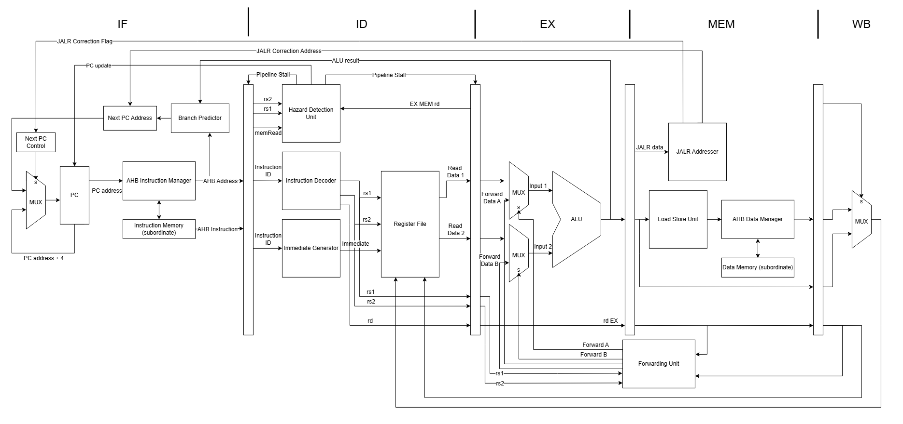
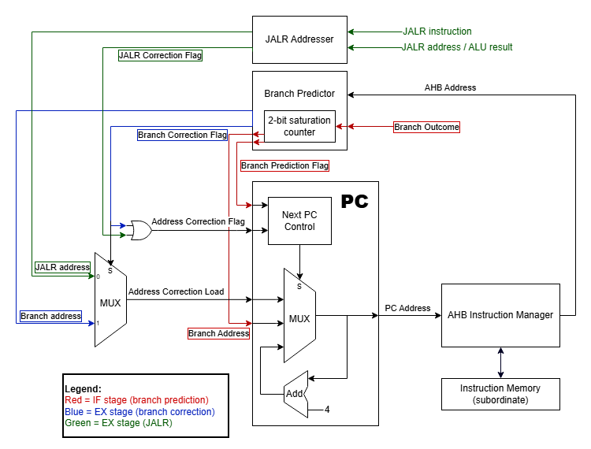
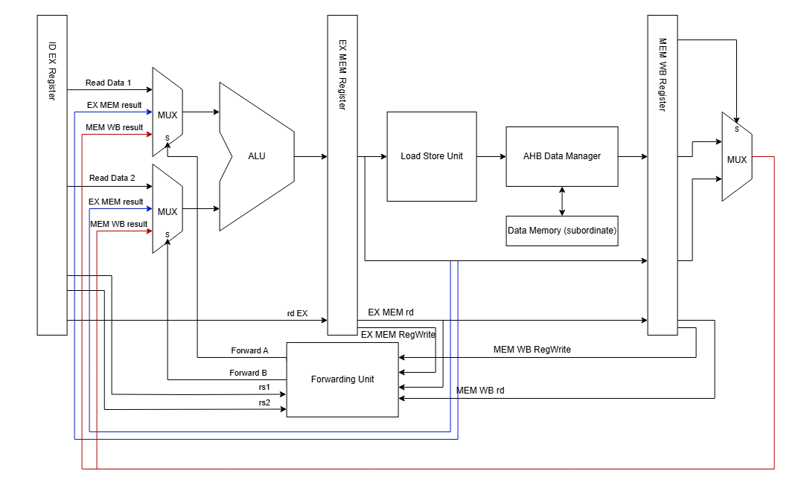

# High-Performance RV32I 5-Stage Pipelined Processor Core

A synthesized, 32-bit RISC-V (RV32I) processor core implemented in SystemVerilog. Designed with a classic 5-stage pipeline, this architecture features dual AHB-Lite bus interfaces for a Harvard-style memory system, full dynamic branch prediction, and comprehensive hazard detection and data forwarding logic to maximize instruction throughput (IPC).

---

## Architectural Highlights

* **ISA Compliance:** RV32I Base Integer Instruction Set with full support for control/status and byte/halfword memory operations.
* **5-Stage Pipeline Architecture:** Standard **IF** $\rightarrow$ **ID** $\rightarrow$ **EX** $\rightarrow$ **MEM** $\rightarrow$ **WB** pipeline designed for maximum operating frequency.
* **Dual AHB-Lite Bus Interfaces (Harvard Architecture):**
  * **I-AHB Master:** Dedicated instruction memory bus utilizing the pipelined address/data phase to achieve 1 instruction per cycle peak throughput.
  * **D-AHB Master:** Dedicated data memory bus utilizing the pipelined address/data phase to manage byte (`SB`/`LB`), halfword (`SH`/`LH`), and word (`SW`/`LW`) transfers.
* **Dynamic Branch Prediction:** 
  * 2-Bit Saturating Counter state machine (`Strongly Not Taken` $\leftrightarrow$ `Strongly Taken`) to minimize control hazards.
  * Zero-cycle penalty for correctly predicted branches; automated pipeline flushes on mispredictions.
* **Advanced Hazard Handling:**
  * **Data Forwarding Unit:** Resolves Read-After-Write (RAW) data hazards (EX $\rightarrow$ EX, MEM $\rightarrow$ EX) without stalling the pipeline.
  * **Hazard Detection Unit:** Identifies non-forwardable Load-Use dependencies and injects hardware stalls.
  * **X0 Register Guarding:** Hardware suppression of writes to `x0` to maintain the zero-register.

## System Architecture

### 1. 5-Stage Core Overview


*Figure 1: RV32I 5-stage pipelined datapath featuring dynamic branch prediction, hazard handling, and dual AHB-Lite bus interfaces.*

* **Pipelined Datapath:** Standard 5-stage pipeline (`IF`, `ID`, `EX`, `MEM`, `WB`) optimized for maximum throughput.
* **Dual AHB-Lite Bus Interfaces:** Independent Instruction and Data bus managers built to handle multi-cycle protocol handshakes (`HREADY`, `HRESP`).
* **Decoupled Control Paths:** High-level abstraction separating raw datapath execution from local control hazard evaluation.

---

### 2. Branch & Jump Control Logic


*Figure 2: Dynamic branch prediction and asynchronous JALR target resolution paths.*

* **2-Bit Dynamic Branch Predictor:** Operates in the `IF/ID` stages using a saturating counter state machine to minimize branch penalty on correct predictions.
* **Dual Resolution Paths:**
  * **Branch Target (EX Stage):** Evaluated in `EX` to limit branch misprediction flush penalties to 2 cycles.
  * **JALR Target (EX Stage):** Evaluated using forwarded ALU results and bit-masking (`~1`), driving target selection via dedicated correction multiplexers.

---

### 3. Hazard Detection & Forwarding Unit


*Figure 3: Execution stage operand forwarding matrix for RAW data dependencies.*

* **Zero-Stall ALU Forwarding:** Bypasses late-written register values directly from `EX/MEM` and `MEM/WB` pipeline registers back to the ALU input MUXes (`Forward A/B`).
* **AHB-Aware Load Stalls:** Intercepts `Load-Use` hazards by monitoring `ID/EX.MemRead` and dynamic instruction opcodes to stretch pipeline holds across multi-cycle bus transactions.


---


## Hardware Modules

| Module Name | Description |
| :--- | :--- |
| RV32I_subsystem | Top-level module connecting the RV32I core with the AHB-Lite bus adapters for instruction and data memory. |
| Core | RV32I processor Module encapsulating pipeline stages, and hazard control.|
| HazardDetection | Detects load-use hazards and manages pipeline stalls and bubble inserts. |
| ForwardingUnit | Determines which operand source is used for the Execution stage from the register file, EX/MEM, or MEM/WB stages. |
| BranchPredictor | 2-bit saturation counter for branch prediction and Execution stage branch correction for mispredictions. |
| AHBDataManager | Manager module controlling the 2-cycle AHB for data memory load and stores. | 
| AHBInstructionManager | Manager module controlling the 2-cycle AHB for instruction fetches. |
| XALU | Execution ALU supporting full 32-bit arithemetic, logical, and shift operations. | 

## Technical Edge Cases & Verification
---

### Verification Strategy

The verification strategy for this RV32I pipelined core uses a hybrid approach: **SystemVerilog Assertions (SVA)** for continuous, cycle-by-cycle structural checks, and a **Comprehensive Dynamic Testbench** for end-to-end instruction execution and hazard validation.

---

### SystemVerilog Assertions (SVA) — Structural Invariants

The `RV32I_core_sva` module runs concurrently during simulation to enforce RISC-V architectural invariants and pipeline protocol rules at every positive clock edge:

* **Architectural Invariants:**
  * **Register `x0` Hardwiring:** Asserts that any write-back targeted to register `x0` strictly evaluates to zero (`writeEnable_WB && rd_WB == 0 |-> registerWriteData == 0`).
  * **PC Word Alignment:** Enforces 4-byte boundary alignment on all instruction fetches (`instructionAddress[1:0] == 2'b00`).
  * **Bus Mutual Exclusion:** Ensures `memRead` and `memWrite` signals are never asserted simultaneously.
  * **Access Alignment:** Verifies that word-sized load and store operations are properly aligned.
* **Pipeline Safety & Hazard Rules:**
  * **Stall Integrity:** Guarantees that `instructionAddress` and the `ID` stage instruction register hold their values during a `pipelineStall`.
  * **Flush Execution:** Ensures pipeline flushes correctly insert a `NOP` into the `ID` stage and clear control write enables in `EX` (`writeEnable_EX == 0`).
  * **X-Propagation Detection:** Flag `$isunknown` (X/Z state) errors on register destination or write-data buses during active write-back cycles.

---

### Dynamic Directed Testbench (`tb_comprehensive`)

The testbench drives binary-encoded RISC-V instruction sequences through simulated Instruction (`imem`) and Data (`dmem`) memories across dedicated execution phases:

#### Core Instruction Suite & Arithmetic Edge Cases
* **Logical & Bitwise Operations (Phase A):** Validates signed/unsigned shifts, immediate handling, and bitwise logic (`AND`, `OR`, `XOR`, `SRLI`, `SLL`).
* **Set-Less-Than Suite (Phase B):** Verifies signed vs. unsigned edge cases (`SLT`, `SLTU`, `SLTI`, `SLTIU`), specifically testing negative rollover (e.g., `-1` vs `1`).
* **Immediate & Address Generation (Phases C & S):** Tests upper immediate loading (`LUI`), program-counter offsets (`AUIPC`), address wrapping, and boundary shift operations (e.g., shifts modulo 32).

#### Pipeline Hazard & Forwarding Matrix
* **Double Forwarding (Phase D):** Tests back-to-back operations requiring simultaneous `EX->EX` bypass on both `rs1` and `rs2` registers.
* **Load-Use Hazards (Phases E & O):** Enforces a 1-cycle data stall when an instruction immediately consumes a load result, alongside multi-cycle non-stalling tests.
* **Control Hazards & Branch Logic (Phases G, H, I, P, Q, T):**
  * Verifies dynamic branch comparisons (`BEQ`, `BLT`, `BGE`, `BLTU`, `BGEU`) using freshly computed register data.
  * Confirms speculative fetch slot flushing ("traitor instruction" suppression) on taken branches and tight loop conditions.
  * Tests ALU-to-`JALR` target calculation forwarding and branch-not-taken fallthrough execution.
* **Forwarding Suppression (Phase R):** Verifies bypass logic suppresses forwarding when source operations target register `x0`.

#### Memory Interface & Sub-Word Granularity
* **Sub-Word Access (Phases F & U):** Validates signed and unsigned byte (`LB`/`LBU`) and halfword (`LH`/`LHU`) loads alongside byte-lane masking for stores (`SB`/`SH`).
* **Return Address Verification (Phases J & K):** Checks link address saving (`PC + 4`) for `JAL` and verifies `JALR` clears the least significant bit (`LSB & ~1`) of target addresses.

#### System Robustness
* **Mid-Execution Reset (Phases M & N):** Asserts reset mid-flight during execution to ensure pipeline registers clear without introducing unknown state (`X` propagation), while preserving core state across soft resets.
* **Watchdog Timeout:** Enforces a maximum cycle limit (`#5000`) to trap unexpected infinite loops or core lockups.

---

## Build and Simulation

```bash
git clone [https://github.com/briancliau/RV32I](https://github.com/briancliau/RV32I)
cd RV32I

# Execute the comprehensive testbench with all edge cases:
# Compile design and testbench
verilator --binary --timing --top --trace tb_comprehensive -f filelist.f

# Run simulation
./obj_dir/Vtb_comprehensive

# View waveform
gtkwave core_test_comprehensive.vcd
```